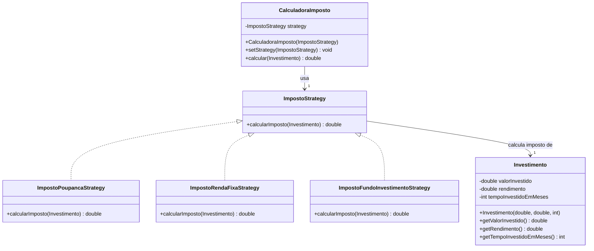

# dio-design-patterns-java

Repositório com o código do desafio "Simulando Uma Conta Bancária Através Do Terminal/Console"

## Calculadora de Impostos para Investimentos com Strategy Pattern

Este projeto implementa uma calculadora de imposto de renda (IR) sobre investimentos em Java utilizando o "Strategy Design Pattern". O objetivo é permitir o cálculo do IR de diferentes tipos de investimentos, como poupança, renda fixa e fundos de investimento, de forma flexível e extensível.

Este exemplo demonstra o poder do Design Pattern Strategy para criar um sistema flexível e extensível no contexto financeiro. A fácil manutenção e adaptação a novas regras de negócio são algumas das vantagens chave dessa abordagem.

## Diagrama UML do Projeto

## Vantagens do "Strategy Design Pattern"

* **Flexibilidade:** Adicione facilmente novos tipos de investimento e suas regras de IR.
* **Reutilização de Código:** As estratégias de cálculo de imposto podem ser reutilizadas.
* **Manutenção:** Mudanças em uma regra de IR não afetam outras ou a calculadora principal.
* **Seleção em Tempo de Execução:** A estratégia de cálculo é escolhida dinamicamente.

## Observações

* Este código simula as regras de IR e não reflete a legislação real.
* Em um cenário real, APIs e bibliotecas especializadas podem ser integradas para cálculos precisos e atualizados.